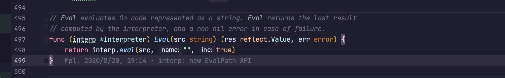
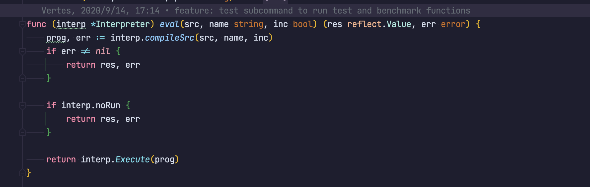
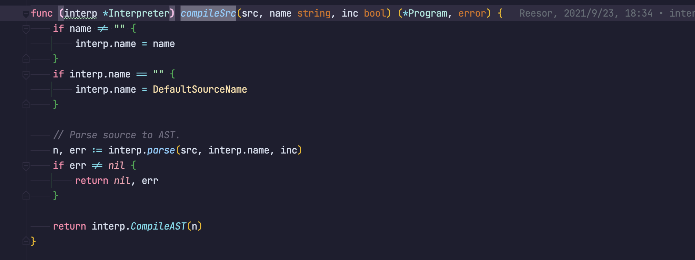

# Yaegi, and something else
Firstly, Yaegi is an interpreter.

In yaegi, we can use the syntax of go as an interpreter.

In most case, yaegi performances as same as go, exectues correct go code, but incorrcet as well.

Look at this code:
```shell
> 1 + 2
```

We write a expression `1+2` without `return`, but we get the result `3` correctly.

If you write directly `1+2` in go, i would say you are insane! 

Lets find out how it possible.

# 1. Parts of language
But whats the difference between interpreter and compiler?

The goal of a compiler or an interpreter is to translate a source program in high-level language into some other form. And if a translator translates a source program into machine language, it is a compiler. If a translator processes and executes the source program without translating it into machine language first, it is an interpreter.

Firstly, we need to find out what behind a language.

## 1. The first step: Scanning
AKA **lexing**, **lexical analysis**.

A **lexer** takes a steam of characters and chunks them together into a series of words. 

Each of these words is called a **token**.

Some tokens are single characters, like `=` `;`.
Others may be several characters long, like a number: `123`.

Insignificant characters: like whitespace, comments...

Lexer will discards these, leaving a clean sequence of meaningful tokens.

### 1.1 Token of go

```go
// Token is the set of lexical tokens of the Go programming language.
type Token int

// The list of tokens.
const (
	// Special tokens
	ILLEGAL Token = iota
	EOF
	COMMENT

	literal_beg
	// Identifiers and basic type literals
	// (these tokens stand for classes of literals)
	IDENT  // main
	INT    // 12345
	FLOAT  // 123.45
	IMAG   // 123.45i
	CHAR   // 'a'
        STRING // "abc"
	literal_end

	operator_beg
	// Operators and delimiters
	ADD // +
	SUB // -
	MUL // *
	QUO // /
	REM // %
)
```

Token is like a word in an English sentence. We extra subject, object, verb in nature language, scanner do it as well, but in programing language.


## 2. The second step: Parsing
A parser takes the flat sequence of tokens and builds a tree structure that mirrors the nested nature of grammer. 

AKA **abstract syntax tree**.

Now, we got the structured 'source code'.

### 2.1 Get ast with go
In go, we can get the ast by this way.
```go
package main

import (
	"go/ast"
	"go/parser"
	"go/token"
	"testing"

	"github.com/stretchr/testify/require"
)


func main(){
    	const code = `
package fake

import "fmt"

func Hello() string {
	return fmt.Sprintf("Hello, world!")
}
`
	fSet := token.NewFileSet()
	astFile, err := parser.ParseFile(fSet, "script.go", code, parser.DeclarationErrors)
	require.Nil(t, err)
	require.Nil(t, ast.Print(fSet, astFile))
}
```

The output looks like this:
```
  0  *ast.File {
     1  .  Package: script.go:2:1
     2  .  Name: *ast.Ident {
     3  .  .  NamePos: script.go:2:9
     4  .  .  Name: "fake"
     5  .  }
     6  .  Decls: []ast.Decl (len = 2) {
     7  .  .  0: *ast.GenDecl {
     8  .  .  .  TokPos: script.go:4:1
     9  .  .  .  Tok: import
    10  .  .  .  Lparen: -
    11  .  .  .  Specs: []ast.Spec (len = 1) {
    12  .  .  .  .  0: *ast.ImportSpec {
    13  .  .  .  .  .  Path: *ast.BasicLit {
    14  .  .  .  .  .  .  ValuePos: script.go:4:8
    15  .  .  .  .  .  .  Kind: STRING
    16  .  .  .  .  .  .  Value: "\"fmt\""
    17  .  .  .  .  .  }
    18  .  .  .  .  .  EndPos: -
    19  .  .  .  .  }
    20  .  .  .  }
    21  .  .  .  Rparen: -
    22  .  .  }
    23  .  .  1: *ast.FuncDecl {
    24  .  .  .  Name: *ast.Ident {
    25  .  .  .  .  NamePos: script.go:6:6
    26  .  .  .  .  Name: "Hello"
    27  .  .  .  .  Obj: *ast.Object {
    28  .  .  .  .  .  Kind: func
    29  .  .  .  .  .  Name: "Hello"
    30  .  .  .  .  .  Decl: *(obj @ 23)
    31  .  .  .  .  }
    32  .  .  .  }
    33  .  .  .  Type: *ast.FuncType {
    34  .  .  .  .  Func: script.go:6:1
    35  .  .  .  .  Params: *ast.FieldList {
    36  .  .  .  .  .  Opening: script.go:6:11
    37  .  .  .  .  .  Closing: script.go:6:12
    38  .  .  .  .  }
    39  .  .  .  .  Results: *ast.FieldList {
    40  .  .  .  .  .  Opening: -
    41  .  .  .  .  .  List: []*ast.Field (len = 1) {
    42  .  .  .  .  .  .  0: *ast.Field {
    43  .  .  .  .  .  .  .  Type: *ast.Ident {
    44  .  .  .  .  .  .  .  .  NamePos: script.go:6:14
    45  .  .  .  .  .  .  .  .  Name: "string"
    46  .  .  .  .  .  .  .  }
    47  .  .  .  .  .  .  }
    48  .  .  .  .  .  }
    49  .  .  .  .  .  Closing: -
    50  .  .  .  .  }
    51  .  .  .  }
    52  .  .  .  Body: *ast.BlockStmt {
    53  .  .  .  .  Lbrace: script.go:6:21
    54  .  .  .  .  List: []ast.Stmt (len = 1) {
    55  .  .  .  .  .  0: *ast.ReturnStmt {
    56  .  .  .  .  .  .  Return: script.go:7:2
    57  .  .  .  .  .  .  Results: []ast.Expr (len = 1) {
    58  .  .  .  .  .  .  .  0: *ast.CallExpr {
    59  .  .  .  .  .  .  .  .  Fun: *ast.SelectorExpr {
    60  .  .  .  .  .  .  .  .  .  X: *ast.Ident {
    61  .  .  .  .  .  .  .  .  .  .  NamePos: script.go:7:9
    62  .  .  .  .  .  .  .  .  .  .  Name: "fmt"
    63  .  .  .  .  .  .  .  .  .  }
    64  .  .  .  .  .  .  .  .  .  Sel: *ast.Ident {
    65  .  .  .  .  .  .  .  .  .  .  NamePos: script.go:7:13
    66  .  .  .  .  .  .  .  .  .  .  Name: "Sprintf"
    67  .  .  .  .  .  .  .  .  .  }
    68  .  .  .  .  .  .  .  .  }
    69  .  .  .  .  .  .  .  .  Lparen: script.go:7:20
    70  .  .  .  .  .  .  .  .  Args: []ast.Expr (len = 1) {
    71  .  .  .  .  .  .  .  .  .  0: *ast.BasicLit {
    72  .  .  .  .  .  .  .  .  .  .  ValuePos: script.go:7:21
    73  .  .  .  .  .  .  .  .  .  .  Kind: STRING
    74  .  .  .  .  .  .  .  .  .  .  Value: "\"Hello, world!\""
    75  .  .  .  .  .  .  .  .  .  }
    76  .  .  .  .  .  .  .  .  }
    77  .  .  .  .  .  .  .  .  Ellipsis: -
    78  .  .  .  .  .  .  .  .  Rparen: script.go:7:36
    79  .  .  .  .  .  .  .  }
    80  .  .  .  .  .  .  }
    81  .  .  .  .  .  }
    82  .  .  .  .  }
    83  .  .  .  .  Rbrace: script.go:8:1
    84  .  .  .  }
    85  .  .  }
    86  .  }
    87  .  Scope: *ast.Scope {
    88  .  .  Objects: map[string]*ast.Object (len = 1) {
    89  .  .  .  "Hello": *(obj @ 27)
    90  .  .  }
    91  .  }
    92  .  Imports: []*ast.ImportSpec (len = 1) {
    93  .  .  0: *(obj @ 12)
    94  .  }
    95  .  Unresolved: []*ast.Ident (len = 2) {
    96  .  .  0: *(obj @ 43)
    97  .  .  1: *(obj @ 60)
    98  .  }
    99  }
```

We get the mirrors of the source code in a tree.

## 3. Static analysis
At this point, we already know the structure of the code, in standard go.

But if in **yaegi**, in a expression `a * b`, we know we are multiping a and b, but we don't know those names refer to.

Now, we need the first analysis called `binding`. For each `identifier`, in previously, `a` and `b`, we find out where that name is defined and wire the two together. And then, we get a `scope`, the region of source code whre a certain name can be used to refer to a certain declaration.

In statically typed language, this is when we do type check. Once we know where `a` and `b` are declared, we can also figure out theri types. Then if those types don't support being multiped, we report a type error.

For now, we got a tones of analysis info, and these info need to be stored somewhere.
- Often, it gets stored right back as attributes in the extra fields in the nodes of ast.
- Other times, we may store data in a table. Typically, the keys to this table are identifiers: names of variables and declarations. In this case, we call it a **symbol table** and the values it associates with each key tell us what that identifier refers to.
- The most powerful bookkeeping tool is to transform the tree into an entirely new data structure that more directly expresses the semantics of the code.

Everything up to this point is considered the **front end** of the interpreter. Don't be in hurry, we will see **back end** and a different stage between **front end** and **back end**.

## 4 intermediate representations
You can think the compiler is a pipeline whre each stage's job is to organize the data representing the user's code in a way that makes the next stage simpler to implement.

The **front end** is specified to the source language. The **back end** is concerned with the final architecture where the program will run.

In the middle, the code may be stored in some **intermediate representation(IR)** that isn't tightly tied to either the source or destination forms. the IR acts as an interface between these two languages.

This make easy to support multiple target platforms. Now, you only write front-end for your language. Otherwise, you may need to write Cxx->ARM, Cxx->X86 by self.

There's another big reason for the IR.

## 5. Optimization
Once we understand what the user's program means, we can optimize it!

A simple example is **constant folding**: if some expression always evaluates to the exact same value, we can do the evaluation at compile time and replace the code for the expression with its result.

If user write:
```
unitArea = 3.14159 * 1 * 1;
```
We can replace it with:
```
unitArea = 3.14159;
```

But some successful language have few compile-time optimizations. Like lua and CPython focus on optimizing runtime performance.

## 6. Code generation
The last step is converting it to a form the machine can actually run. The code refers to the kind of primitive assembly-like instructions a CPU runs.

Now, we are in the **back end**, our code become primitive. And we have to make decision, generate instructions for a real CPU or a Virtual one. 

If we generate real machine code, we get an executable that the CPU can load directly onto the chip. Native code is fast, but generating it needs a lot of time. And speaking the chip language means compiler is tied to a specific architechture.If your compiler targets x86 machine code, it's not going to run on an ARM device.

If we choose virtual one, instead of instructions for some real chip, we produced code for a hypothetical, idealized machine. We generally call it **bytecode** because each instruction is often a single byte long.

## 7. Virtual Machine
If we produce bytecode, our work isn't over.

Since there is no chip that speaks that bytecode, its our job to translate. 

Again, we need to make a choice:
1. write a compiler for each target architechture that converts the bytecode to native code for that machine
2. build a virtual machine
    ```
    a program that emulates a hypothetical chip supporting virtual architecture at runtime.
    ```
    runing bytecode in a VM is slower than translating it to native code ahead of time because every instruction must be simulated at runtime each time it executes.
    But we get simplicity and portability.

## 8. Runtime
We finally make user's program into a form that we can execute. The last step is running it. If we compiled it to machine code, we simply tell the operating system to load the executable and off it goes.If we compiled it to bytecode, we need to start up the VM and load the program into that.

In both cases, we need some services that out language provides while the program is running.
For example, if the language automatically manages memory, we need a garbage collector going in order to reclaim unused bits.

All of this stuff is going at runtime, so it's called the **runtime**. In full compiled language, the code implementing the runtime gets inserted directly into the resulting executable, like Go.
And if the language is run inside an VM, then the runtime lives there, like Java, Python.


## 9. Some Shortcuts
Its a long path to walk, but there are a few shortcuts.


### 2. Tree-walk interpreters
Some PL begin executing code right after parsing it to an AST.
To run the program, the interpreter traverses the syntax tree one branch and leaf at a time, evaluating each node as it goes.
It tends to be slow in this way.

### 3. Transpilers
Write a complete back end for a language can be a lot of work. But what if there has been a existing IR?
What we have to do is make an IR of IR.

First, we build our frontend, then in the backend, we trun it into other source-code in high level.
Then we can reuse the existed backend.

This usually called `source-to-source compiler` or  `transpiler`, and usually set the target as C. Because C can be compiled at any UNIX. 

Today, many languages are transpiled to JS to run in a browser.

### 4. JIT (just-in-time compilation)
This way is for experts. You can do the same thing like what the JVM doing now.

When the program loaded, bytecode for JVM, compile it to native code for the architecture their computer support.

In HotSpotJVM there even exists a recompile stage.

# 2. Front End
We can use a huge switch-case to scan the source code and emit a flat sequence of Tokens.

But token is powerless.

Then CFG(Context-Free-Grammer) coming. Wait, what is CFG?

Here has a lot of words to say, but in here, you can think it is used for describing a language.

If we define a rule like this:
```BPF
aa = "Abc";
bb = 3 * aa, "B";
```

then if we input `bb`, we will get `AbcAbcAbcB`.

Looks like regular expression, but not character, token rather.

If we get the expression like this:
```
1 - (2 * 3) < 4 == false
```

We can write a grammar like this:
```
expression -> literal
            | unary
            | binary
            | grouping ;

literal -> NUMBER | STRING | "true" | "false" | "nil";
grouping       → "(" expression ")" ;
unary          → ( "-" | "!" ) expression ;
binary         → expression operator expression ;
operator       → "==" | "!=" | "<" | "<=" | ">" | ">="
               | "+"  | "-"  | "*" | "/" ;
```

Now the grammer can be seem as a bone of code. We build different expression on it.

like:
```rust
pub enum Expr {
    Literal(Literal),
    Unary(UnaryOp, Box<Expr>),
    Binary(Box<Expr>, BinaryOp, Box<Expr>),
    ...
}
```
We have got the Tokens before, then we can build a list of Expr, and then the Expr will be recursive, then we get the Tree.

Finally, the front-end finish, backend is beyond my power.

# At the last, have a look on the guts of Yaegi.

1. Firstly, the entry point



2. Compile the source code
 
The most important part it the Parse function
```go
func (interp *Interpreter) parse(src, name string, inc bool) (node ast.Node, err error) {
	var inFunc bool
    // do some wrap
	if inc {
		tok = interp.firstToken(src)
		switch tok {
		case token.PACKAGE:
			// nothing to do.
		case token.CONST, token.FUNC, token.IMPORT, token.TYPE, token.VAR:
			src = "package main;" + src
		default:
			inFunc = true
			src = wrapInMain(src)
		}
		// Parse comments in REPL mode, to allow tag setting.
		mode |= parser.ParseComments
	}

    // some check...
	if ok, err := interp.buildOk(&interp.context, name, src); !ok || err != nil {
		return nil, err // skip source not matching build constraints
	}

    // then call go original token Parser
	f, err := parser.ParseFile(interp.fset, name, src, mode)
    ....
}
```

3. self-ast
To reach the goal of some special Grammer,
The yaegi define a CFG and self AST


Check here [cfg of Yaegi](https://github.com/traefik/yaegi/blob/master/interp/cfg.go#L52)


Yaegi is a littel different, bacause it is based on Go, so it can get AST first and then do his work after.

This [function](https://github.com/traefik/yaegi/blob/master/interp/run.go#L177) is about how Yaegi really do its eval. The main idea is wrap a eval into a closure and call it, I guess.